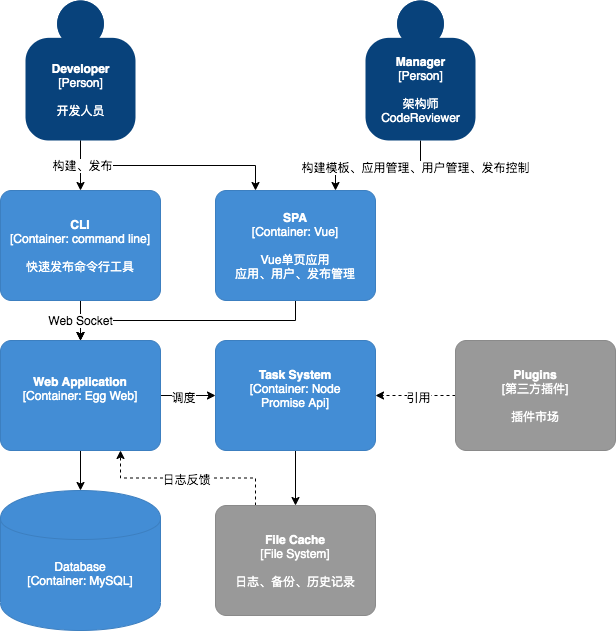
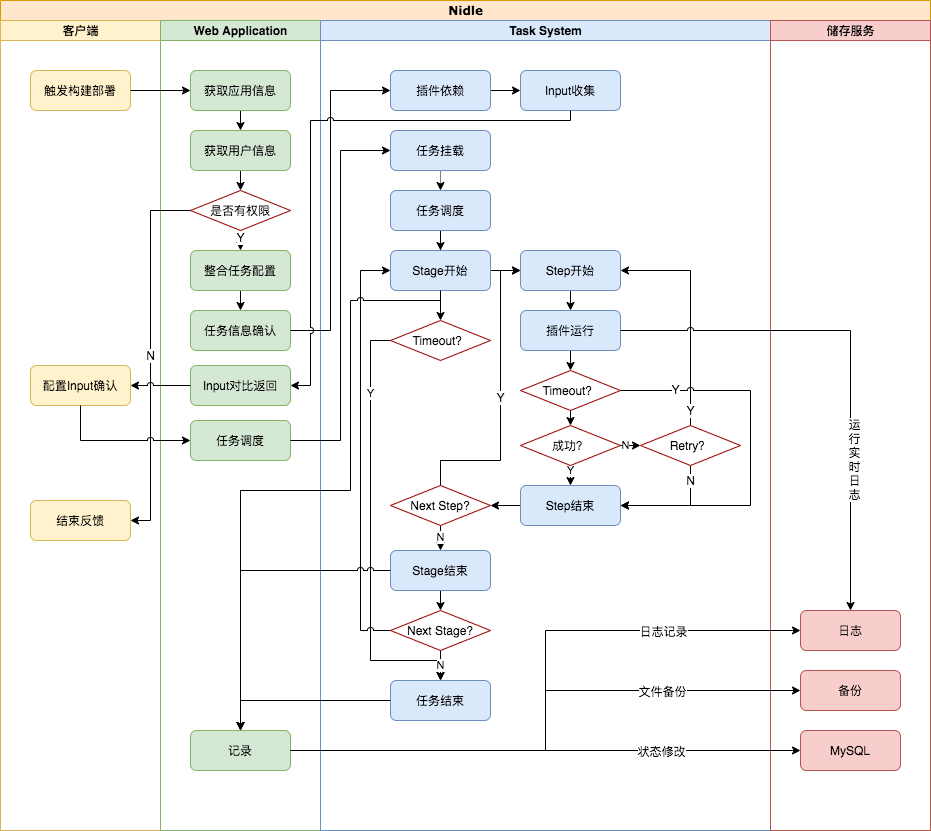

# 架构设计
> 本文的架构制图主要基于`C4模型`，通过自顶向下对系统的静态结构进行逐级拆分，依次描述各层次对象的职责、关系和外部依赖

## Level1: System Context diagram
**What is CI/CD**
首先，既然我们要做的自动化CI/CD工具，那先看下它是什么，它要做什么;

CI 持续集成；强调开发人员提交了新代码之后，立刻进行构建、（单元）测试。根据测试结果，我们可以确定新代码和原有代码能否正确地集成在一起

CD 持续交付/持续部署；在持续集成的基础上，将集成后的代码部署到更贴近真实运行环境(类生产环境)中

从两张网络图片可以看出，CI/CD是一个流程
1. 开发人员开发完某个功能
2. 触发了构建触发器（提交代码webhook或者手动触发等）
3. 构建服务器接收到请求，开始通知调度器开始构建任务（打包、测试、反馈）
4. 然后如果是CD，还会继续将构建结果部署到服务器
5. 持续把任务结果反馈给开发

## Level2: Container diagram
所以可以看出我们要做工作分成三大容器：
1. 触发器：`CLI`、`UI`、webhook
2. Web Application：接收触发请求、连接调度器、反馈构建结果、团队/应用/日志管理、权限控制
3. 调度器：任务处理器，支持插件扩展

## Level3: Component diagram
继续将容器功能细化，就可以得出功能模块图

## Level4: Code
### 整体流程图

### 参考文献
* [架构制图：工具与方法论](https://mp.weixin.qq.com/s?__biz=MzUzNzYxNjAzMg==&mid=2247494834&idx=1&sn=3a94a4dce52e6e0fe4b1351cb700ed3e&scene=21#wechat_redirect)
* [CI/CD是什么？如何理解持续集成、持续交付和持续部署](https://www.redhat.com/zh/topics/devops/what-is-ci-cd)
* [CI/CD网络图片参考](https://www.jianshu.com/p/5f671aca2b5a)
* [如何搭建适合自己团队的构建部署平台](https://juejin.cn/post/6987140782595506189)
* [如何系统搭建 CI/CD](https://juejin.cn/post/6993676240603316231)
